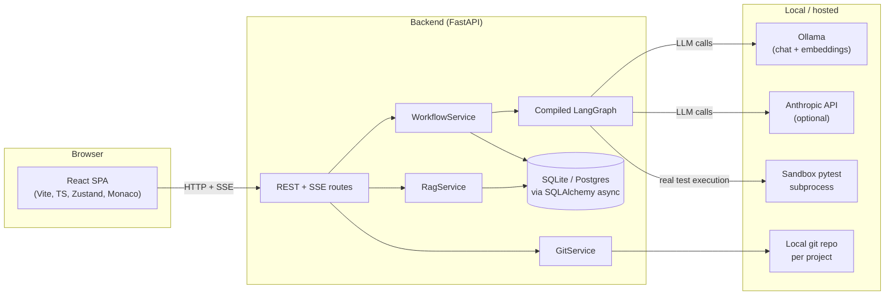
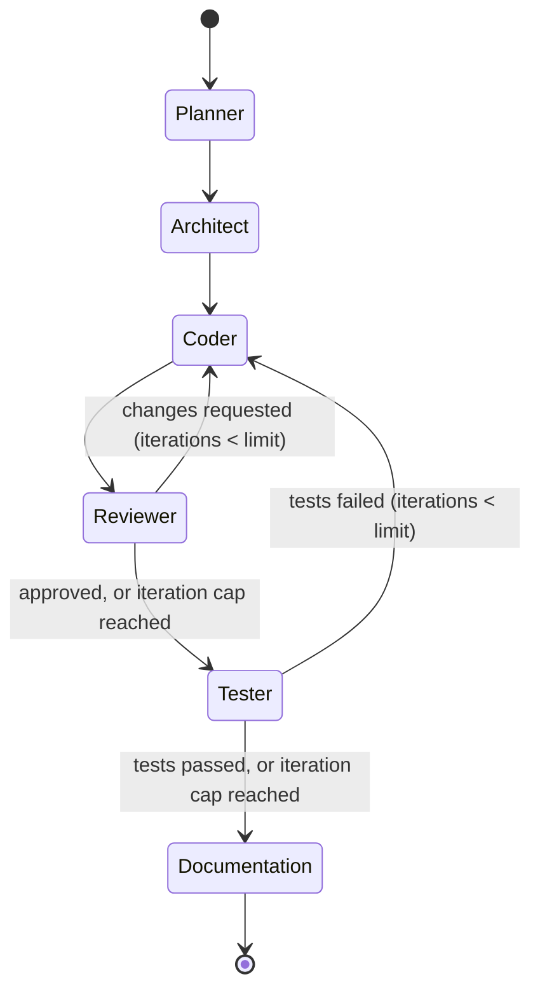
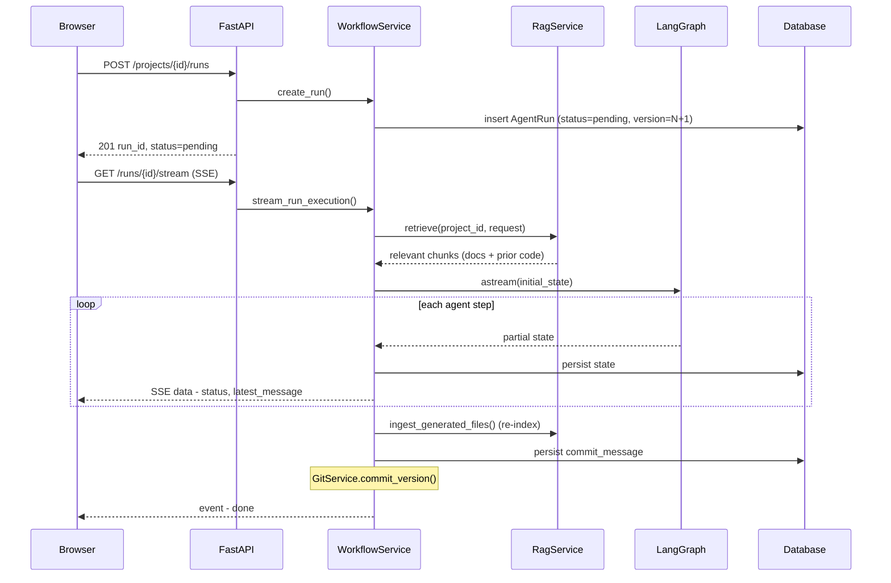
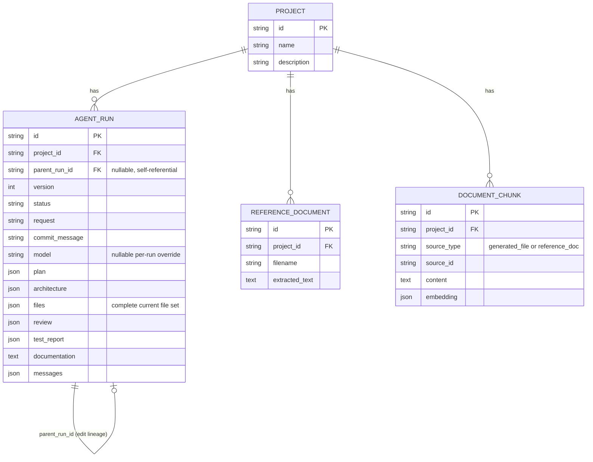
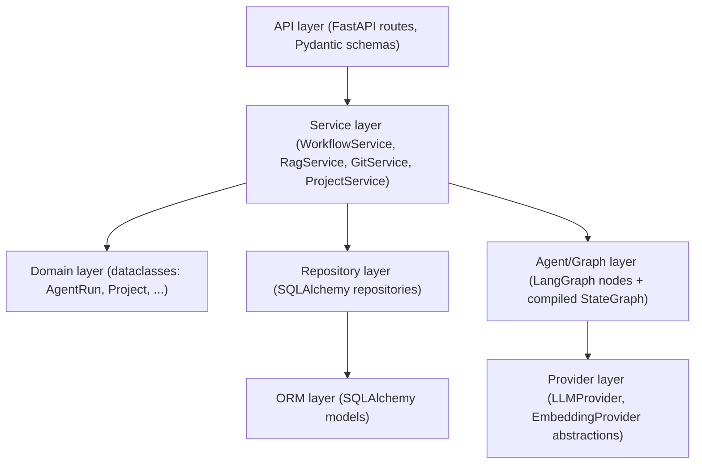

# Architecture Overview

## System overview

## The agent pipeline

Six LangGraph nodes, two capped feedback loops. The Tester node does not ask
an LLM whether tests "would" pass -- it materializes the generated files into
an isolated temp directory and actually runs `pytest`.

| Agent | Responsibility | LLM call? |
|---|---|---|
| Planner | Breaks the request into an ordered task list | Yes |
| Architect | Produces component design, tech choices, file layout | Yes |
| Coder | Generates/edits files -- returns only **changed** files, merged with existing state | Yes |
| Reviewer | Code review against the design; approves or requests changes | Yes |
| Tester | **Actually executes `pytest`** in a sandboxed subprocess | No (static-analysis fallback only for non-Python targets) |
| Documentation | Writes the final README from the real generated files | Yes |

## Request lifecycle (a single run)

## Data model

Note the deliberate choice to store `files`, `plan`, `architecture`, `review`,
`test_report`, and `messages` as JSON columns on the `AGENT_RUN` aggregate
rather than normalizing into a dozen join tables: this aggregate is always
loaded and saved as a whole, never queried piecemeal, so JSON columns avoid
join overhead without sacrificing queryability on the columns that matter
(`status`, `version`, `project_id`, timestamps are real indexed columns).

## Layering (Clean Architecture)

- **Domain** objects (`app/domain/models.py`) are plain dataclasses with zero
  framework imports -- no FastAPI, no SQLAlchemy, no LangGraph.
- **Repositories** convert between ORM rows and domain objects at the
  persistence boundary (`app/db/mappers.py`); services never see ORM types.
- **Providers** (`LLMProvider`, `EmbeddingProvider`) are the single swap
  point between `Ollama` (default, real), `Anthropic` (real, alternate), and
  `Mock` (deterministic, tests only) -- this is what lets the entire test
  suite run with zero network calls while production code is unchanged.

## Security model

This is a **local, single-user development tool**. Deliberate scope
decisions, stated explicitly:

- **No authentication/authorization.** The FastAPI app has no user accounts,
  sessions, or API keys of its own. It's designed to run on `localhost` for
  one developer. Exposing it beyond localhost without adding an auth layer
  (e.g., a reverse proxy with OAuth2/OIDC in front) is not supported.
- **Path traversal defenses** are applied everywhere generated content
  touches the filesystem: the sandbox test executor, the git commit
  materializer, and the ZIP export all resolve paths and reject anything
  that would escape their target directory (verified by dedicated tests).
- **Upload validation**: reference documents are restricted to an allowlist
  of extensions/content-types (`.txt`, `.md`, `.pdf`) and a 10MB size cap.
- **Git tokens** are accepted per-push-request only, injected into the
  remote URL transiently for that single `git push` subprocess call, and
  never written to disk, the database, or logs (verified by a dedicated
  leak-detection test).
- **Secrets** (`MACA_ANTHROPIC_API_KEY`) come from environment variables
  only and are never logged.
- **CORS** is restricted to an explicit origin allowlist, not `*`.
